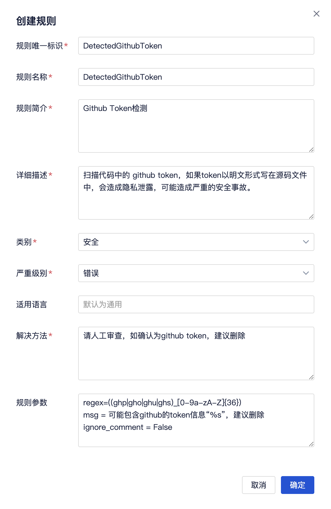
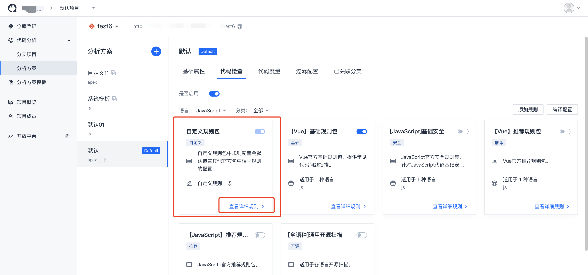
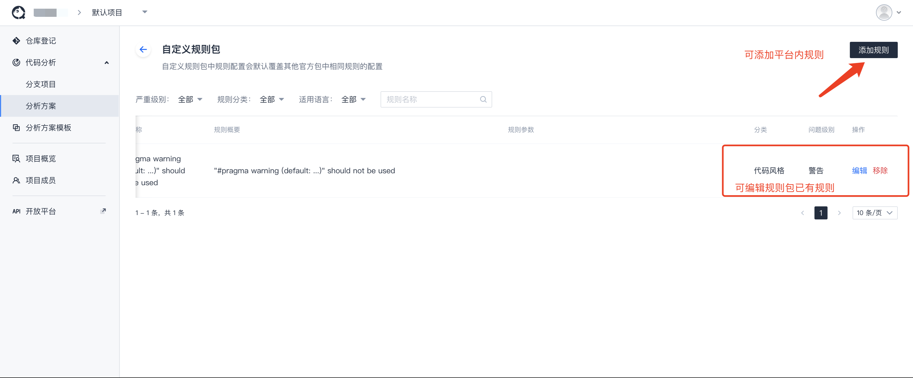

# RegexScanner 使用手册

自研工具RegexScanner，支持页面直接**自定义编写规则**。

## 适用场景
- 检测项目中的文件名，比如漏洞文件log4j-core-2.10.1.jar
- 检测代码文件中的文本内容，比如高危函数vsscanf
- 检测配置文件中的文本内容，比如账号密码明文

## 对比regexscan、regexfilescan
- 单个工具即可完成文件名和文件内容的检查
- 扫描速度更快，大概减少60%的耗时
- *只支持go的正则语法，会比python的少一些*

## 快速接入
以下是接入步骤：

1. 属于增强分析模块，需要先[部署CLS](../../../quickStarted/enhanceDeploy.md)
2. 在代码分析创建项目，自定义规则包里添加想要进行扫描的RegexScanner规则
3. 启动分析即可

## 自定义规则
### 1. 添加规则
进入工具管理入口，进入RegexScanner工具页面，选择上方的“自定义规则”，然后点击“添加规则”:

### 2. 填写规则信息
进入“创建规则”页面，按照需求填写相关信息，完成后，点击页面最后的“确定”按钮提交。

### 规则示例：
规则扫描场景：扫描代码中的 github token，如果token以明文形式写在源码文件中，会造成隐私泄露，可能造成严重的安全事故。

正则表达式：匹配 github token 字符串，根据github token的一般形式，可以推断出正则表达式 ((ghp|gho|ghu|ghs)_[0-9a-zA-Z]{36})。

::: tip
**只支持go正则语法: [regexp](https://pkg.go.dev/regexp/syntax)**
:::

建议先测试好正则表达式是否正确，正则表达式测试网站推荐：http://tool.oschina.net/regex

### 字段解释
规则名称、前端展示名称：建议使用单词首字母大写的格式，如 DetectedGithubToken

规则简述：作为扫描出来到问题标题

规则参数：

- (1) 参数格式类似ini的格式， 也就是key = value的格式

- (2) [必选] `regex` 参数，用于指定扫描的正则表达式， 例如: regex = ((ghp|gho|ghu|ghs)_[0-9a-zA-Z]{36})。**只支持go正则语法: [regexp](https://pkg.go.dev/regexp/syntax)**。建议先测试好正则表达式是否正确，正则表达式测试网站推荐：[http://tool.oschina.net/regex](http://tool.oschina.net/regex)

- (3) [必选] `msg` 参数，用于展现issue说明， 例如： msg = 检测到高危函数%s，建议替换。

  - msg中的“%s”使用regex中的group（用“()"括起来的部分）一一匹配

  - 如果regex没有定义group，则msg最多有一个%s, 并由整个regex匹配的字符串替代

  - 如果msg里没有包含“%s”，则直接显示msg

  - 如果msg没有提供，则会给出默认信息

- (4) [可选] `ignore_comment` 参数，用于指定是否忽略注释代码，可选值：True、true、False、false 。例如 ignore_comment=True, 默认是False

- (5) [可选] `file_scan` 参数，用于指定是否扫描文件名称，可选值：True、true、False、false 。例如 file_scan=True, 默认是False

- (6) [可选] `include` 参数，用于将指定扫描文件匹配范围，使用正则匹配格式，多项使用英文分号（;）隔开。例如

include = path/to/dir;path/to/.*\\.cpp

- (7) [可选] `exclude` 参数，用于指定不扫描的文件匹配范围。格式参考include参数。

### 3. 将自定义规则添加到项目分析方案中
进入 代码分析 - 分析方案 - 代码检查 - 自定义规则包 - 查看详细规则，添加规则。

