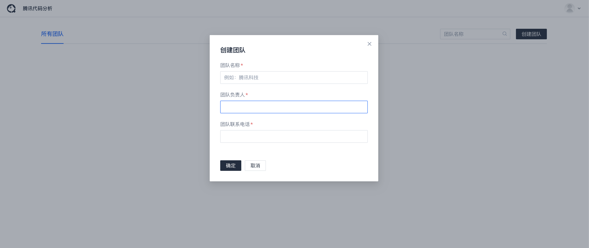
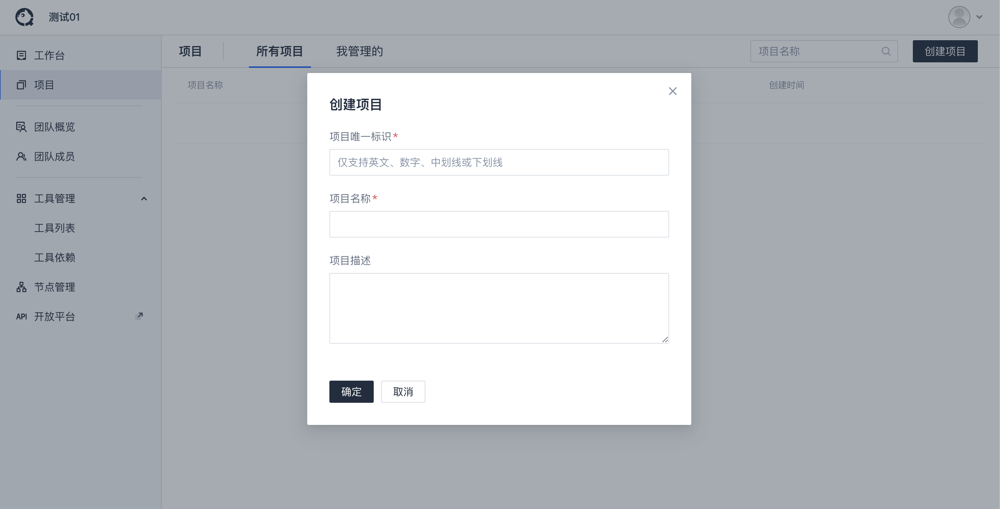
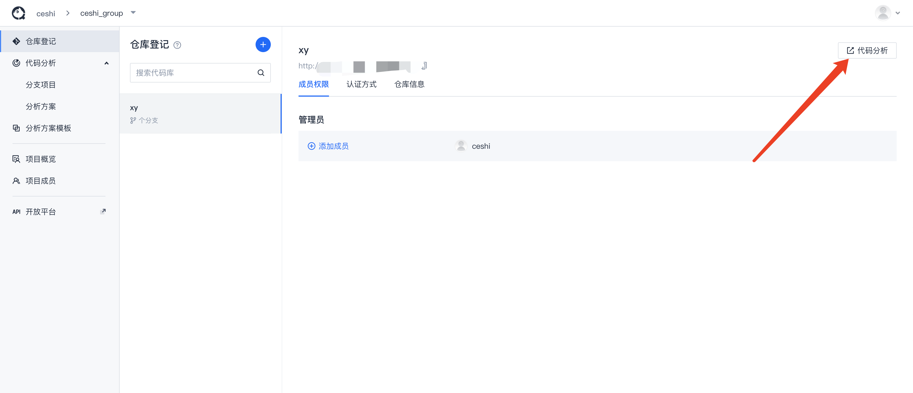

# 快速启动一次代码分析

## 创建团队及项目

- **创建团队**  
  点击了解[团队管理](../团队管理/团队管理.md)

  

- **为团队创建一个项目，或选择一个已有项目，并进入项目内**

  

## 登记代码库

- **完成代码库登记，并点击进入代码分析**

  

  

## 启动代码分析

### 执行初始化创建

  

  ::: tip

  1. 首次开启代码分析，用户可选择使用已有的分析方案模板，或创建分析方案的。
  2. 点击确认时，平台会首先创建该代码库的分析方案，然后根据代码库分支、当前分析方案创建分支项目，供用户启动代码分析。
  :::

### 执行代码分析

初始化创建项目后，可通过 `在线分析` 或 `客户端分析` 来启动代码分析。

#### 在线分析

在线分析即是通过Server端将分析任务注册到执行队列中，并将任务分配到平台配置的常驻分析节点上进行，分析完毕后将分析结果上报入库。

::: tip
使用在线分析要求平台具有常驻分析节点：
- 如您的TCA平台是使用官方一键部署脚本完成的环境部署（Docker部署、Docker-Compose部署、源码部署三种），默认已启动一个分析节点（即客户端），可直接用于在线分析。可查看[管理入口-节点管理](../后台管理/节点管理.md)确认该节点状态。

- 您也可自行接入更多分析节点实现并行执行代码分析，接入节点操作请查阅[常驻节点分析](../客户端/常驻节点分析.md)

**如无分析节点，在线分析任务将无法完成分配，未分配任务将于超时后自动注销**。
:::

#### 客户端分析

客户端分析即是本地分析，需要在本地有客户端，并配置好客户端配置文件 `codedog.ini`，详细操作参考：[启动客户端分析](../客户端/本地分析.md)。分析完毕后会将数据上报入库。

## 查看分析历史

分析结束后，数据会上报到服务端。可进入分析历史页面查看分析记录以及分析结果。

## 查看分析概览

分析结束后，进入分支概览可以查看该分支指定分析方案的概览数据以及 [问题列表](../代码检查/分析结果查看.md)等。

