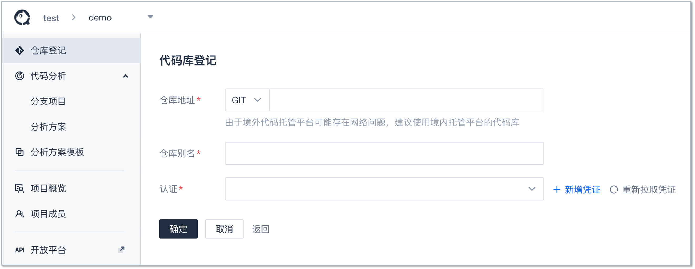
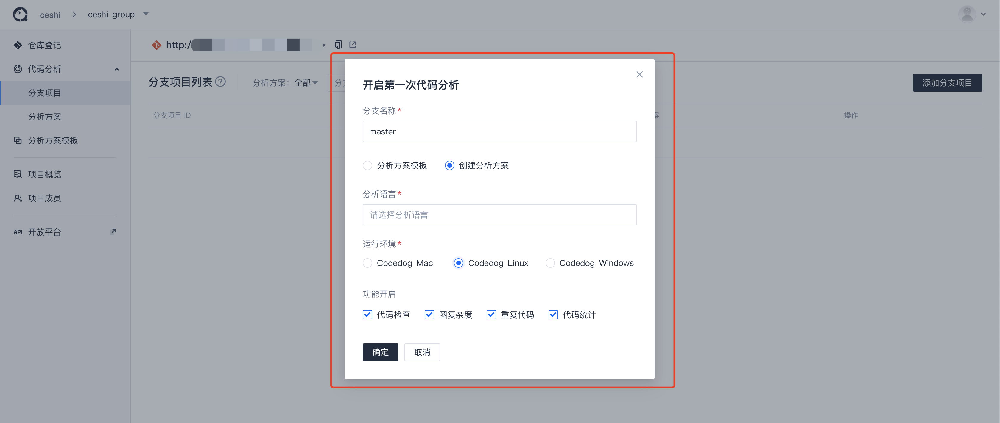

# 部署 TCA
TCA提供部署脚本，支持一键式快速部署server、web、client。  
脚本共提供三种部署方式：docker部署(推荐)、[docker-compose部署](./dockercomposeDeploy.md)、[源码部署](./codeDeploy.md)，可根据您的具体使用场景任意选择其一进行部署。

## Docker快速部署

:::warning
仅适用于Docker部署体验，生产环境建议使用专业的 MySQL、Redis 等服务
:::

### 依赖环境

- 系统环境
  - Linux、macOS、Windows
  - 最低配置：2核4G内存、100G硬盘存储空间
- 环境准备
  - Docker
- 权限准备
  - 需要开放80、8000端口的访问权限(80为TCA平台访问端口，8000为TCA Server访问端口)

### 部署对象
Server、Web 与 Client

### 操作说明
#### 首次启动操作

1. 进入CodeAnalysis工作目录（例如``~/CodeAnalysis``)，以下路径均为目录内的相对路径
2. 执行命令：
    ```bash
    bash ./quick_install.sh docker deploy
    ```

注：通过Docker部署默认会在当前根目录下的挂载三个路径：

- `.docker_temp/logs`：容器内的`/var/log/tca/`，存放TCA平台的日输出文件；
- `.docker_temp/data`：容器内的`/var/opt/tca/`, 存放TCA平台的服务数据，主要是Mariadb、Redis；
- `.docker_temp/configs`：容器内的``/etc/tca``，存放TCA平台的配置文件，主要是`config.sh`

#### 更新操作
1. 更新代码
2. 执行以下命令：
    - `TCA_IMAGE_BUILD=true ./quick_install.sh docker deploy`：重新构建并启动tca容器

注：`TCA_IMAGE_BUILD=true`表示从本地构建TCA镜像运行

#### 运行容器
如果已经在机器上执行过``docker deploy``，并保留容器数据的，可以执行以下命令启动容器，继续运行TCA

```bash
bash ./quick_install.sh docker start
```

#### 停止容器
如果容器正在运行，希望停止容器，可以运行

```bash
bash ./quick_install.sh docker stop
```

# 使用TCA
成功部署TCA后，请开始您的代码分析。
## 进入平台页面

在浏览器输入`http://部署机器IP/`，点击立即体验，完成登录后即可跳转到团队列表页

:::tip
默认平台登录账号/密码：CodeDog/admin

如部署过程中，已调整默认账号密码，请按照调整后的账号密码进行登录
:::

## 创建团队及项目

- 完成团队创建

- 完成项目创建

## 登记代码库

登记代码库，输入代码库地址以及凭证信息等，完成代码库登记。



## 创建分析项目



::: tip

1. 用户可选择使用分析方案模板，或创建分析方案的方式，利用方案的分析配置进行代码分析。
2. 点击确认时，平台会首先创建该代码库的分析方案，然后根据代码库分支、当前分析方案创建分支项目。
:::

### 分析方案说明

- 分析方案是用于对代码库进行分析的一套配置集合。

- 更多分析方案配置可查阅[帮助文档-分析方案](../guide/分析方案/基础属性配置.md)


注：运行环境请选择「Codedog_Linux」


## 执行代码分析

初始化创建项目后，可通过 `在线分析` 或 `客户端分析` 来启动代码分析。


注：  
- TCA推荐使用`在线分析`，您可根据具体使用场景选择其一。
- `在线分析`表示配置代码库链接后，TCA客户端拉取代码后进行分析；`客户端分析`在配置本地待扫描代码路径后，无需代码拉取直接分析本地代码。  
- `在线分析`与`客户端分析`具体详情及配置参考[TCA客户端配置详情](../guide/客户端/配置详情.md)

## 查看分析历史

分析结束后，数据会上报到服务端。可进入分析历史页面查看分析记录以及分析结果。


## 查看分析概览

分析结束后，进入分支概览可以查看该分支指定分析方案的概览数据以及 [问题列表](../guide/代码检查/分析结果查看.md) 等。

